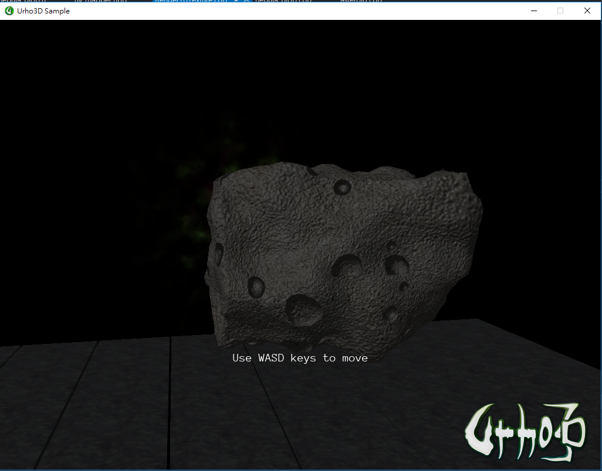
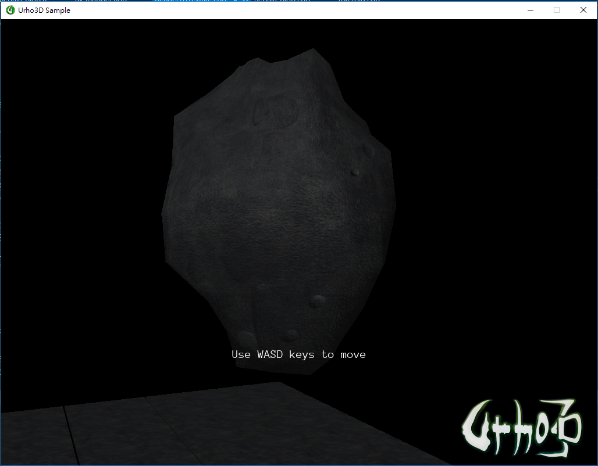

# procedural_asteroid
attempt to generate asteroid using Urho3D

## Sample images
UV mapping

Triplanar mapping

## Approach:

Mesh:
1. Generate a subdivided cube or sphere mesh in 1x1x1 bounding box
2. Random scale the mesh
3. Cut the mesh by random planes. Cut means project the vertices behind the plane onto the plane.
4. Displace vertices along normal by noise.

For texturing, there are 2 ways:
1. UV mapping (drawback: there will be seams)
    1. Cut the mesh to two half, use [auto_uv_map](https://github.com/silky/auto_uv_map) to generate UV.
    2. Use Urho3D built-in function GenerateTangents() to generate tangent.
2. Triplanar mapping (drawback: the bumpness is not as clear as method 1)
    1. Modify LitSolid shader to LitSolidTriplanar by referencing internet articles.

Normal map:
1. Generate height map by placing some random craters and white noise.
2. Port [NormalMap-Online](https://github.com/cpetry/NormalMap-Online) shader to c++ to generate normal map from height map.
    

## used/referenced resources:
**Used code and textures remain their own license**

[auto_uv_map](https://github.com/silky/auto_uv_map)(Eigen) for uv mapping generated mesh

[FastNoise](https://github.com/Auburns/FastNoise) for noise

[NormalMap-Online](https://github.com/cpetry/NormalMap-Online) for generate normal map from height map

[spheres](https://github.com/caosdoar/spheres) for sphere mesh

[www.textures.com](https://www.textures.com/) for some diffuse textures

[Normal Mapping for a Triplanar Shader](https://medium.com/@bgolus/normal-mapping-for-a-triplanar-shader-10bf39dca05a) for normal map of triplanar mapping

